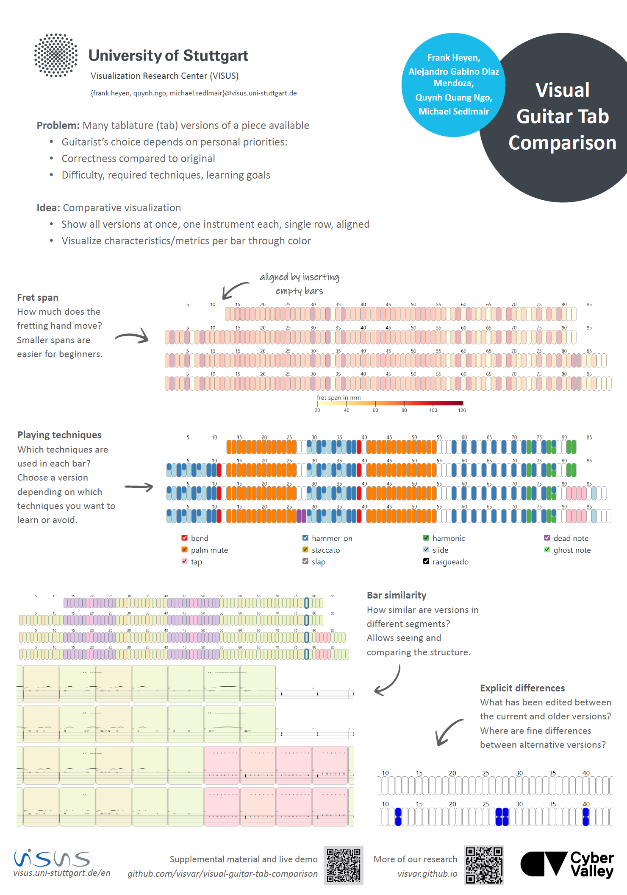

# visual-guitar-tab-comparison

A visual interface for comparing different tab versions of the same piece.

[Online here!](https://visvar.github.io/visual-guitar-tab-comparison)

You need Guitar Pro files, which you can find online (some websites require a free account).
Our try our [examples](./examples/).

See our [ISMIR 2023 late-breaking demo poster](https://ismir2023program.ismir.net/lbd_357.html) for more information ([poster](./media/357_poster.pdf), [paper](./media/357_paper.pdf)).

You might also be interested in our [ISMIR paper on visual sheet music overviews](https://github.com/visvar/sheetmusic-overviews/), or our [other research](https://visvar.github.io/).

## Setup

- Install NodeJs and npm.
- `cd visual-guitar-tab-comparison`
- `npm install`

## Starting

- `npm run dev`

## Examples

- Open the displayed local URL in your browser
- In the tool, open the files in `examples/`

## Contributing

Feel free to contribute to this project in any way!
See [TODO.md](./TODO.md) for possible features.
